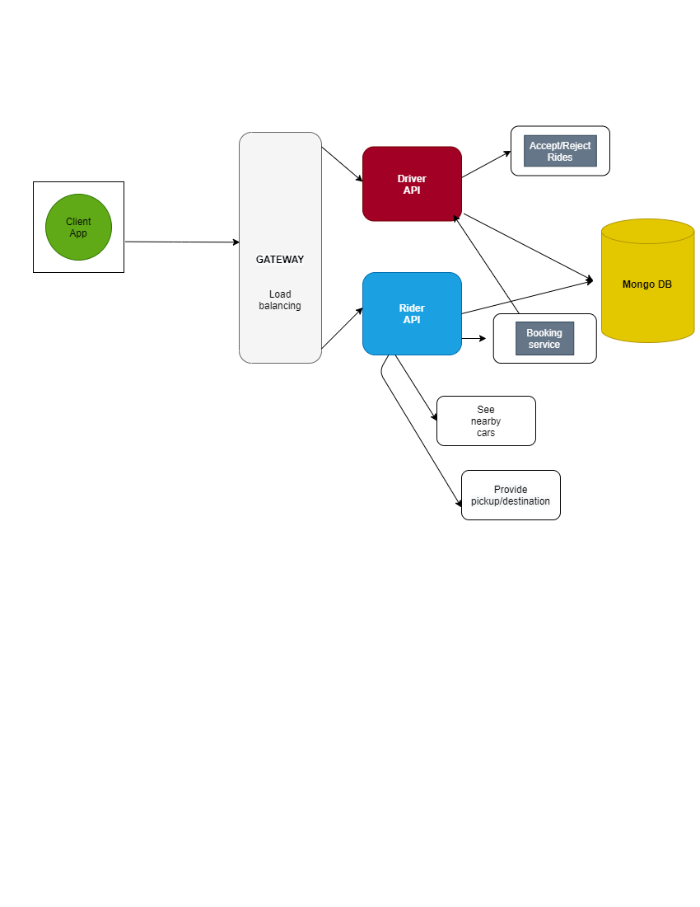
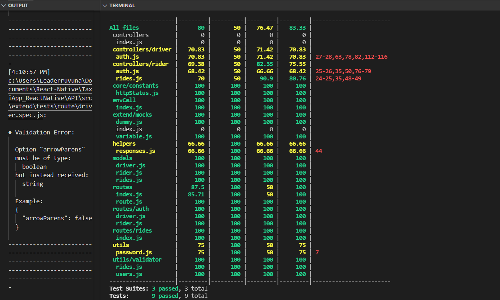
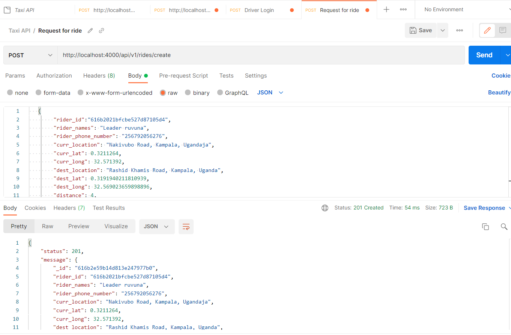
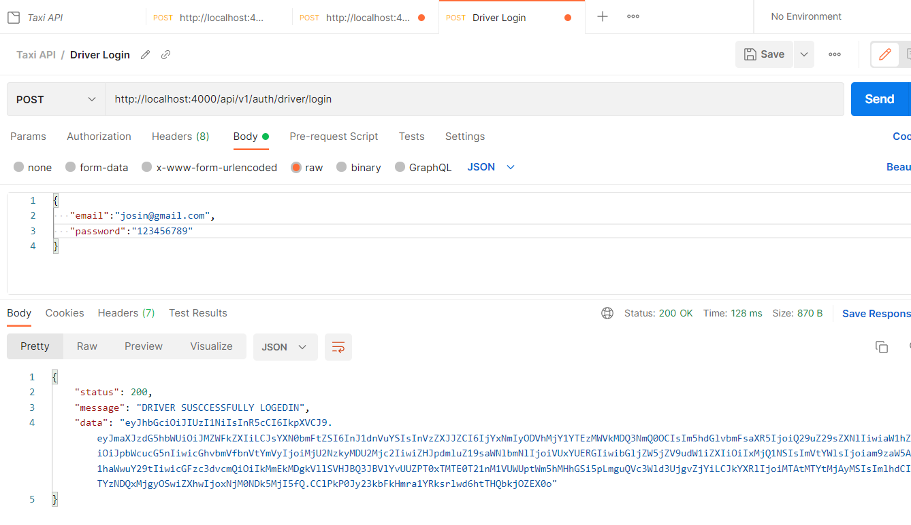

## TAXI APP  API

### API DOCS

## SYSTEMS DESIGN

High level diagram for the taxi booking app including client and API architecture.

    

### UNIT TESTS CURRENT COVERAGE 

    

### API REQUESTS SCREENSHOTS (driver signup and create rides req...)

    
    

## Prerequisites

1. NodeJS installed(min v12.14.1)
3. NPM(min 6.13.4)

